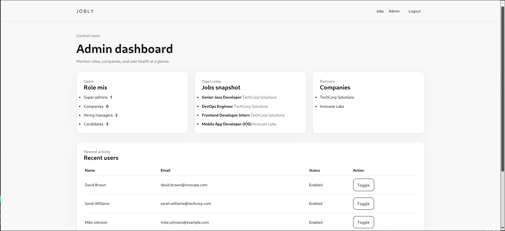
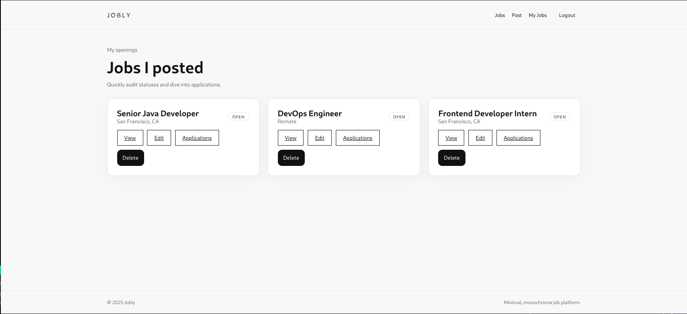
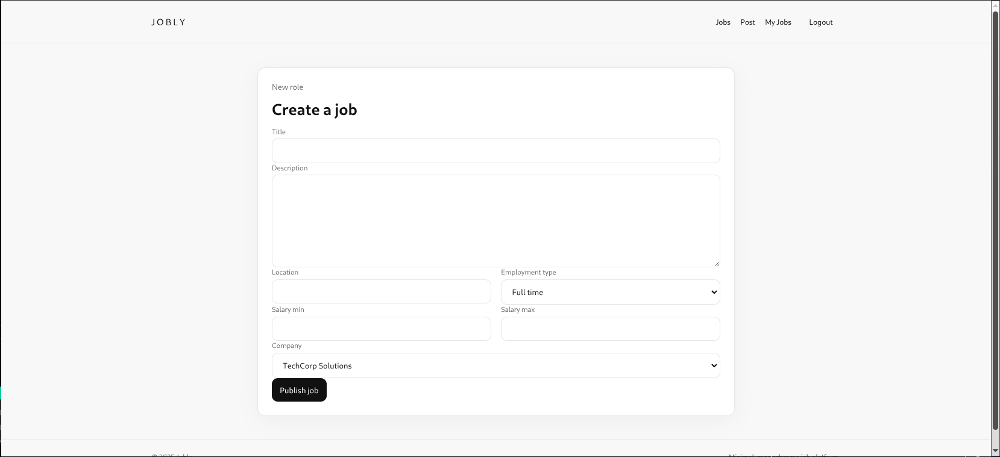
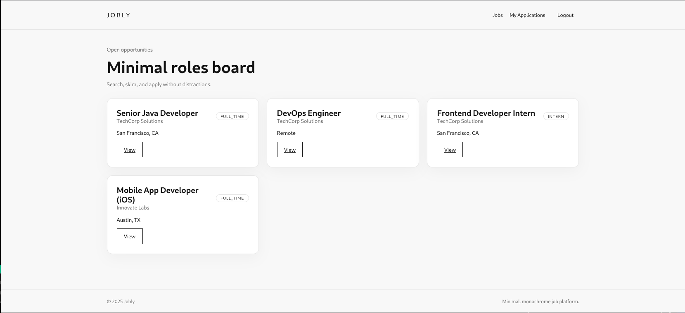
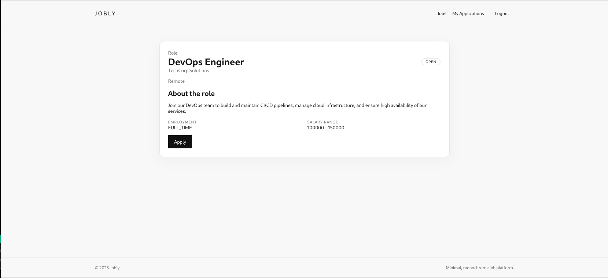
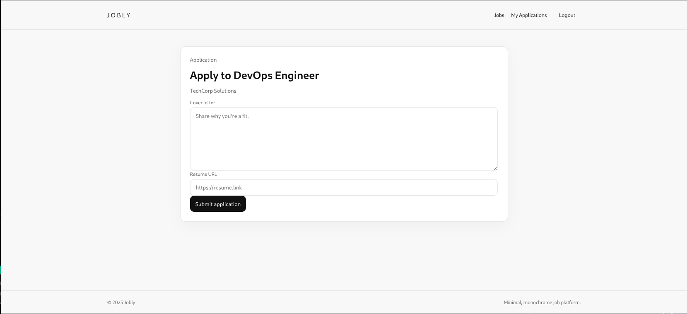
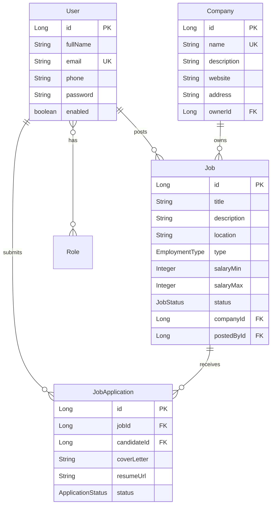

# 🎯 Jobly - Job Posting Platform

<div align="center">


**A modern, role-based job posting platform built with Spring Boot**

[Features](#-features) • [Quick Start](#-quick-start) • [Demo Accounts](#-demo-accounts) • [Documentation](#-documentation)

</div>

---

## 📋 Overview

Jobly is a full-featured job posting and application platform that connects job seekers with employers. Built with enterprise-grade technologies, it demonstrates best practices in Spring Boot development, security, and modern web architecture.

### 🎭 User Roles

- **👔 Candidates** - Browse jobs, submit applications, track application status
- **🏢 Companies** - Create company profiles, post job openings
- **📊 Hiring Managers** - Manage job postings, review applications
- **⚙️ Super Admin** - Platform oversight and user management

---

## 📸 Screenshots

### Admin Dashboard

*Comprehensive admin panel for managing users, companies, and job postings*

### Company Portal


*Company dashboard showing overview and quick actions*


*View and manage all job postings for your company*


*Create and edit job postings with detailed information*

### Candidate Portal


*Candidate dashboard with personalized job recommendations*


*Detailed job listing view with company information*


*Submit job applications with cover letter and resume*

---

## ✨ Features

### Core Functionality
- ✅ **Role-Based Access Control** - Secure authentication with 4 distinct user roles
- ✅ **Job Management** - Full CRUD operations for job postings
- ✅ **Application System** - Complete job application workflow with status tracking
- ✅ **Company Profiles** - Dedicated company pages with job listings
- ✅ **Admin Dashboard** - Comprehensive platform management tools

### Technical Highlights
- 🔐 **Spring Security** - BCrypt password encryption, session management
- 📊 **JPA/Hibernate** - Auto-generated database schema with audit trails
- 🎨 **Thymeleaf Templates** - Server-side rendering with reusable components
- 📝 **Validation** - Comprehensive input validation and error handling
- 📚 **API Documentation** - Swagger/OpenAPI integration
- 🔍 **Exception Handling** - Centralized error management

---

## 🚀 Quick Start

### Prerequisites

- **Java 21** (LTS)
- **MySQL 8.0+**
- **Maven 3.6+**

### Installation

1. **Clone the repository**
   ```bash
   git clone https://github.com/yourusername/jobly.git
   cd jobly
   ```

2. **Create MySQL database**
   ```sql
   CREATE DATABASE jobly;
   CREATE USER 'jobly_user'@'localhost' IDENTIFIED BY 'your_password';
   GRANT ALL PRIVILEGES ON jobly.* TO 'jobly_user'@'localhost';
   FLUSH PRIVILEGES;
   ```

3. **Configure application**

   Update `src/main/resources/application.properties`:
   ```properties
   spring.datasource.url=jdbc:mysql://localhost:3306/jobly
   spring.datasource.username=jobly_user
   spring.datasource.password=your_password
   ```

4. **Run the application**
   ```bash
   ./mvnw spring-boot:run
   ```

5. **Access the application**

   Open your browser to: `http://localhost:8080`

---

## 👥 Demo Accounts

The application comes with pre-configured test accounts. See [CREDENTIALS.txt](CREDENTIALS.txt) for the complete list.

### Quick Access

| Role | Email | Password |
|------|-------|----------|
| Super Admin | admin@jobly.com | Admin@123 |
| Candidate | john.doe@example.com | Password@123 |
| Hiring Manager | sarah.williams@techcorp.com | Password@123 |

**Sample Data Included:**
- 3 Candidates
- 2 Companies (TechCorp Solutions, Innovate Labs)
- 5 Job Postings
- 4 Job Applications

---

## 🏗️ Architecture

### Tech Stack

**Backend**
- Spring Boot 3.3.5
- Spring Security 6
- Spring Data JPA
- Hibernate ORM
- MySQL 8.0

**Frontend**
- Thymeleaf 3.1
- HTML5 & CSS3
- JavaScript

**Tools & Libraries**
- Lombok - Reduce boilerplate code
- Springdoc OpenAPI - API documentation
- BCrypt - Password encryption
- Maven - Build automation

### Project Structure

```
com.jobly/
├── config/              # Configuration classes
│   ├── SecurityConfig   # Spring Security setup
│   ├── DataInitializer  # Dummy data seeding
│   └── OpenApiConfig    # Swagger configuration
├── controller/          # MVC Controllers
│   ├── AuthController
│   ├── JobController
│   ├── ApplicationController
│   └── AdminController
├── dto/                 # Data Transfer Objects
├── exception/           # Exception handling
├── model/              # JPA Entities
│   ├── User
│   ├── Role
│   ├── Company
│   ├── Job
│   └── JobApplication
├── repository/         # Spring Data repositories
├── security/           # Security components
└── service/            # Business logic
```

---

## 🗄️ Database Schema

### Core Entities



---

## 🔐 Security

### Authentication & Authorization

- **Session-based authentication** with Spring Security
- **BCrypt password hashing** with secure work factor
- **Role-based access control** using method-level security
- **CSRF protection** enabled for all forms
- **SQL injection prevention** via JPA prepared statements

### Security Features

```java
@PreAuthorize("hasRole('SUPER_ADMIN')")
public void adminOnlyMethod() { }

@PreAuthorize("hasAnyRole('COMPANY', 'HIRING_MANAGER')")
public void postJob() { }
```

---

## 📡 API Documentation

Interactive API documentation is available via Swagger UI:

**URL:** `http://localhost:8080/swagger-ui.html`

### Key Endpoints

| Method | Endpoint | Description | Access |
|--------|----------|-------------|--------|
| GET | `/jobs` | List all jobs | Public |
| GET | `/jobs/{id}` | Job details | Public |
| POST | `/jobs` | Create job | Hiring Manager |
| POST | `/jobs/{id}/apply` | Apply to job | Candidate |
| GET | `/admin/dashboard` | Admin panel | Super Admin |

---

## 🧪 Testing

### Running Tests

```bash
# Run all tests
./mvnw test

# Run with coverage
./mvnw test jacoco:report
```

### Test Structure

- **Unit Tests** - Service layer logic with Mockito
- **Integration Tests** - Full application context with test database
- **Controller Tests** - MVC layer with `@WebMvcTest`

---

## 📦 Deployment

### Building for Production

```bash
# Create executable JAR
./mvnw clean package

# Run the JAR
java -jar target/Jobly-0.0.1-SNAPSHOT.jar
```

### Docker Deployment

```dockerfile
FROM eclipse-temurin:21-jre
COPY target/*.jar app.jar
ENTRYPOINT ["java","-jar","/app.jar"]
```

### Environment Variables

```bash
SPRING_DATASOURCE_URL=jdbc:mysql://db:3306/jobly
SPRING_DATASOURCE_USERNAME=jobly_user
SPRING_DATASOURCE_PASSWORD=secure_password
```

---

## 📚 Documentation

- [CREDENTIALS.txt](CREDENTIALS.txt) - Test user accounts
- [HELP.md](HELP.md) - Spring Boot reference
- [LICENSE](LICENSE) - Project license

---

## 🛣️ Roadmap

### Planned Features

- [ ] Resume upload & file storage (S3 integration)
- [ ] Email notifications (SMTP/SendGrid)
- [ ] Advanced job search & filtering
- [ ] Pagination & sorting
- [ ] Analytics dashboard
- [ ] Database migrations (Flyway/Liquibase)
- [ ] REST API for mobile apps
- [ ] Social authentication (OAuth2)

---

## 🤝 Contributing

Contributions are welcome! Please follow these steps:

1. Fork the repository
2. Create a feature branch (`git checkout -b feature/AmazingFeature`)
3. Commit your changes (`git commit -m 'Add some AmazingFeature'`)
4. Push to the branch (`git push origin feature/AmazingFeature`)
5. Open a Pull Request

### Coding Standards

- Follow Java naming conventions
- Use meaningful variable and method names
- Write JavaDoc for public methods
- Include unit tests for new features
- Format code with Google Java Format

---

## 📄 License

This project is licensed under the MIT License - see the [LICENSE](LICENSE) file for details.

---

## 👨‍💻 Author

**Your Name**
- GitHub: [@yourusername](https://github.com/yourusername)
- LinkedIn: [Your Profile](https://linkedin.com/in/yourprofile)

---

## 🙏 Acknowledgments

- Spring Boot team for the excellent framework
- Thymeleaf community for template engine
- All contributors and testers

---

<div align="center">

**⭐ Star this repo if you find it helpful!**

Made with ❤️ using Spring Boot

</div>
